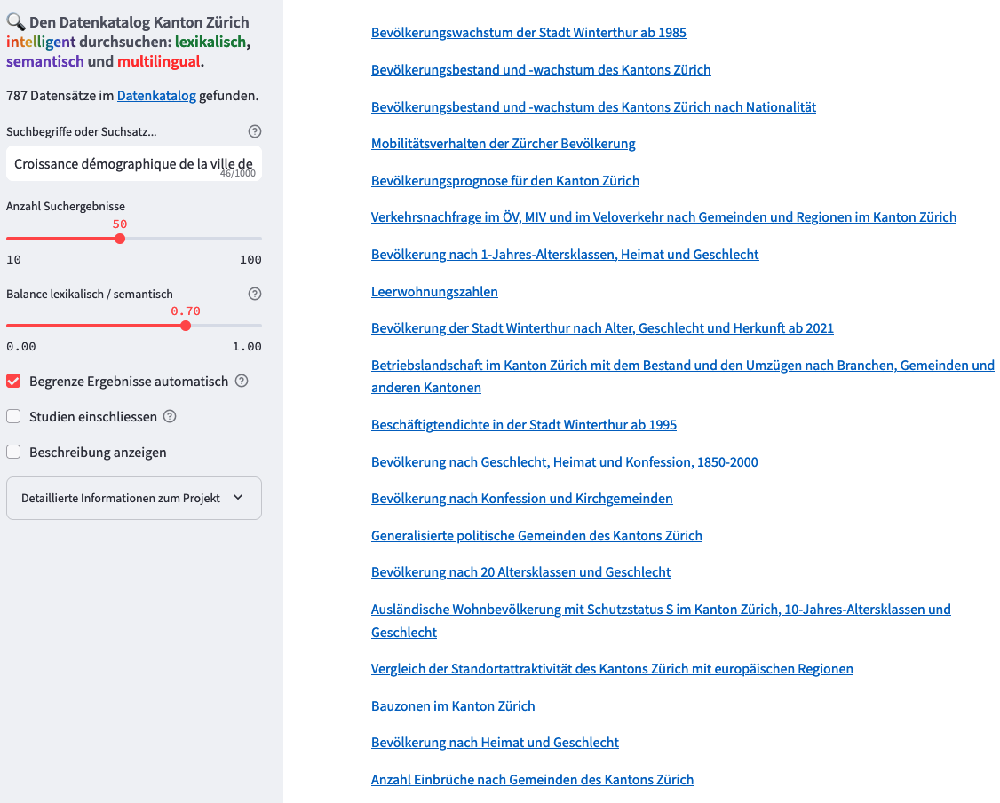

# 🦄 OGD AI Search

**Search semantically, lexically, and multilingually in your OGD metadata catalog.**


[](https://github.com/machinelearningZH/ogd_ai-search)
[](https://github.com/machinelearningZH/ogd_ai-search/stargazers)
[](https://github.com/machinelearningZH/ogd_ai-search/issues)
[](https://img.shields.io/github/issues-pr/machinelearningZH/ogd_ai-search)
[](https://github.com/machinelearningZH/ogd_ai-search)
<a href="https://github.com/astral-sh/ruff"></a>

<details>
<summary>Contents</summary>

- [Usage](#usage)
- [What does the code do?](#what-does-the-code-do)
- [What is semantic search?](#what-is-semantic-search)
- [Project team](#project-team)
- [Feedback and contributing](#feedback-and-contributing)

</details>



## Usage

- Create a [Conda](https://conda.io/projects/conda/en/latest/index.html) environment: `conda create -n aisearch python=3.9`
- Activate environment: `conda activate aisearch`
- Clone this repo.
- Change into the project directory.
- Install packages: `pip install -r requirements.txt`
- Create an `.env` file and input your OpenAI API keys:

```
    OPENAI_API_KEY=sk-...
```

- Run the notebook and create the search index with the Open Source database [Weaviate](https://weaviate.io/).
- Change into the app directory: `cd _streamlit_app/`
- Start the app: `streamlit run aisearch.py`

## What does the code do?

This application allows you to search the [Canton of Zurich's open government data catalog](https://www.zh.ch/en/politics-state/statistics-data/data-catalog.html#/). It combines exact **lexical keyword searches** with **semantic searches based on meaning and similarity**. The search supports **multiple languages**, including all European languages and many others.

For this prototype app we use OpenAIs embeddings for convenience. We also tested these **open source models with [SentenceTransformers](https://sbert.net/) with very good results**:

- [PM-AI/bi-encoder_msmarco_bert-base_german](https://huggingface.co/PM-AI/bi-encoder_msmarco_bert-base_german) - 350 tokens context length
- [Jina AI jina-embeddings-v2-base-de](https://huggingface.co/jinaai/jina-embeddings-v2-base-de) - 8192 tokens context length

> [!Note]
> The app sends all your search queries to an [embedding interface (API) at OpenAI](https://platform.openai.com/docs/guides/embeddings). Please avoid entering sensitive information that you do not want or are not permitted to share with third-party providers like OpenAI.

## What is semantic search?

Unlike a lexical search, which looks for exact keywords, a semantic search considers text that is semantically similar but does not have to match the search term exactly. For example, a semantic search for the word *disease* can find documents containing the words *illness*, *virus*, *infection*, *treatment*, or *healthcare* without the word *disease* appearing in the documents.

Semantic search uses statistical methods and Machine Learning (ML). By analyzing large amounts of text, ML language models for semantic search have learned word and sentence similarities, enabling them to search for documents based on these similarities. While semantic search has many advantages, it is not exact but approximate. Therefore, **semantic search results itself may not be complete and can include false hits or miss relevant entries**.

**Combining lexical and semantic to hybrid search gives you the best of both worlds.** You get exact lexical but also semantically similar matches in your search results.

## Project team

This is a project of [Team Data of the Statistical Office of the Canton of Zurich](https://www.zh.ch/de/direktion-der-justiz-und-des-innern/statistisches-amt/data.html). Responsible: Laure Stadler and Patrick Arnecke. Many thanks go to **Corinna Grobe**, **Lucinda Monteiro**, and our former colleague **Adrian Rupp**. Merci! ❤️

## Feedback and contributing

We would love to hear from you. Please share your feedback and let us know how you use the code. You can [write an email](mailto:datashop@statistik.zh.ch) or share your ideas by opening an issue or a pull requests.

Please note that we use [Ruff](https://docs.astral.sh/ruff/) for linting and code formatting with default settings.
